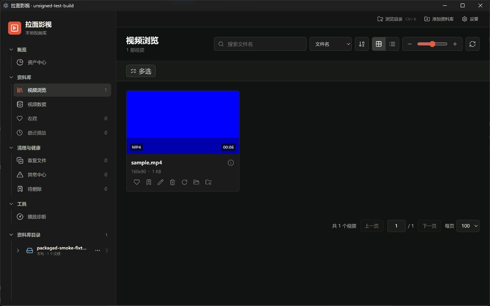
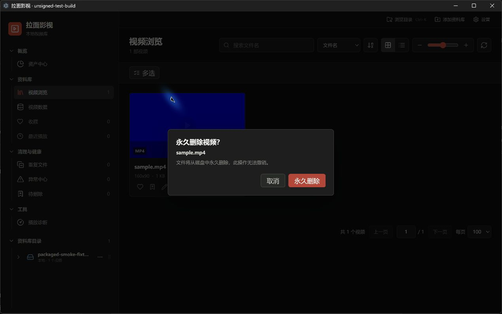

# 映匣（当前 Windows 程序名：拉面影视）

Windows x64 的本地视频资料库。使用 Electron、React 和 SQLite 管理索引、封面、收藏、播放记录和视频目录；视频保留在原位置。

需要解压即用的程序包？当前支持 [Windows ZIP 免安装版](docs/portable.md)，开发者使用 `npm run dist:zip`；候选 ZIP 与安装器受到相同的公开发行门槛保护。

**第一次接触？** 阅读 [快速开始](docs/QUICK_START.md)、[Windows 安装与文件校验](docs/windows-installation.md)、[第三方组件说明](THIRD_PARTY_LICENSES.md)。**个人免费分享的维护者只需先看 [最简发布指南](docs/OPEN_SOURCE_RELEASE_SIMPLE.md)**，历史详细审计文档不必逐篇阅读。当前安装包尚未批准公开发行；[v0.1.15 发行说明草稿](docs/release-notes-v0.1.15-draft.md) 不是可下载版本。

**免费分享项目 · MIT 开源。** 维护者已选择将有权授权的项目自有代码和文档以 [MIT License](LICENSE) 公开提供；任何人均可免费使用、复制、修改和再分发，须保留版权及 MIT 许可声明。作者不计划商业化，但 MIT 本身不禁止他人商业使用。

**Windows 安装包尚未正式发布。** 目前的 `unsigned-test-build` 仅用于隔离测试，**不能作为可公开分发的正式安装包**。第三方 FFmpeg/FFprobe、Electron、NativeHost 引用的第三方代码或其他依赖，分别遵守各自许可，不因项目采用 MIT 而变成 MIT。可先使用公开源码；可下载的正式安装包需完成原生依赖分发材料与安全测试后再上架。详见 [发布审计](docs/public-release-audit.md) 和 [第三方授权](docs/legal/RELEASE-COMPLIANCE.md)。

## 实际功能

- 添加本地来源目录，递归扫描视频和读取 FFprobe 元数据；网格/表格、搜索、收藏、播放历史、分页、缺失文件与异常复查。
- 支持嵌套来源和目录浏览、图片缩略图及大图浏览；移除来源只移除索引，不删除源视频。
- 可配置 CloudDrive2 API 扫描、挂载目录及远端重复候选清理；HTTP 仅允许严格回环地址，其他连接必须 HTTPS。
- 封面和时间轴预览采用可重建的独立缓存，默认上限 10 GiB；清理缓存不删除源视频。
- 独立播放窗口，Chromium 能播放的格式可直接播放；当前隔离候选包将内嵌 mpv 的固定运行库一起打包，无需用户单独配置 DLL，运行库公开发行许可仍待审查。
- 可选在线字幕搜索/下载与本地字幕；搜索可能向提供方发送文件名、关键词和语言等信息。
- 移动、重命名和永久删除；永久删除不进入 Windows 回收站，删除后不能依靠 SQLite 恢复视频。

重复候选来自大小、时长等元数据，**不等于内容完全相同**。当前工作分支已关闭无哈希验证的快速删除入口：必须先读取内容计算完整 SHA-256，确认完全相同后，才允许在任务中心输入 `DELETE` 明确确认永久删除。无法完整验证、任务过期或身份变化时均拒绝删除。此功能可能永久删除原视频，使用前请自行备份。旧已安装版本可能仍有之前的危险入口，务必以版本为准。

## 安装与系统要求

目标系统：Windows 11 x64；当前实机是 Windows 11 Insider，干净稳定版 Windows 11 验收仍需完成。
普通用户运行安装包不需要安装 Node.js、npm 或开发工具。
首版计划使用独立身份的**无签名免费分享版**，只应从维护者批准的 GitHub Release 获取；当前没有本轮正式发行。

测试包拥有独立 appId、安装名和 `%APPDATA%\local-video-manager-unsigned-test` 数据目录，不能当作现有正式版的升级包。
完整下载、SHA-256、签名核对、安装、迁移和卸载步骤见 [普通用户安装教程](docs/windows-installation.md)。
遇到 SmartScreen 或发布者不符应停止并核实来源；不要为了安装测试包关闭系统防护。

截图来自实际 unsigned-test-build，仅使用合成蓝色视频及临时资料库；旧交付记录里的真实资料库截图不作为公众素材。

## 隐私与数据位置

正式身份保持 appId `com.local.video.manager`、产品名“拉面影视”、版本 0.1.15；正式资料路径为
`%APPDATA%\local-video-manager`。库文件是 `library.sqlite`；设置、脱敏日志、字幕、封面/时间轴缓存也位于专属数据目录。
卸载保留应用数据和源视频。SQLite 备份不能替代原始视频备份。

CloudDrive Token 仅在主进程使用 Windows DPAPI 密文存储；Renderer 不读取 Token。
更换 Windows 用户/电脑后可能需要重新配置凭据。凭据损坏会停用该连接并提示重新输入，不静默切换到环境变量里的其他账户。
存在可重试清理任务时，必须先审查/清除其任务记录才能修改连接；旧未绑定任务需重新创建。

应用不上传整个资料库作为核心工作流程。CloudDrive 和字幕功能会按配置/用户操作连接外部服务，网络提供方有自己的隐私政策。
诊断包仅包含白名单环境信息和脱敏日志，但导出后仍应先审阅再分享。

## 开发和验证

工具链固定 Node.js 22.23.1 / npm 10.9.8。本轮升级到 Electron 44.7.0、better-sqlite3 13.0.3、Vite 8.3.3、Vitest 5.0.3。npm 10 的 N-API 安装缺陷及 `install:locked` 入口见 [原生模块工作流](docs/native-abi-workflow.md)。
Electron 官方只支持最新三个稳定主版本；版本升级须重跑原生 ABI、三窗口 IPC/CSP、媒体、迁移、删除、打包和安装测试。
参见 [官方支持政策](https://www.electronjs.org/docs/latest/tutorial/electron-timelines)。

Node 测试 checkout：

~~~powershell
npm run install:locked
npm run test:release-gate
npm audit
~~~

独立 Electron 打包 checkout：

~~~powershell
npm run install:locked
npm run package:dir
npm run test:electron-smoke
npm run test:renderer-security-smoke
npm run verify:artifact
npm run test:packaged-smoke
npm run dist:win
npm run release:metadata
npm run test:installer-smoke
~~~

SQLite13 官方 N-API 文件已在 Node 与 Electron 中分别实测验证；旧版11 ABI文件不能复用，详见 [原生模块工作流](docs/native-abi-workflow.md)。
隔离测试包输出在 `release/unsigned-test-build`；拟采用的免费社区版使用单独的 `release/unsigned-public-release` 身份和目录，绝不重命名测试包。旧的 `release/signed-release` 是未选择的付费签名通道，**首版社区版不需要购买证书**。真实发布前仍须满足对应源码/许可及安装安全核对；现有工程门禁在证据不齐时继续拒绝发行，参见 [最简指南](docs/OPEN_SOURCE_RELEASE_SIMPLE.md) 和 [技术工作流](docs/release-workflow.md)。

## 已知限制与维护

- npm audit不覆盖原生EXE。现有媒体二进制落后于官方后续安全修复，确切补丁适用性及替换方案未闭环，见 [二进制安全审查](docs/legal/native-binary-security.md)。
- **默认 BtbN 候选**仍属于历史来源的未批准媒体工具；拟公开的社区版明确选择 [FFmpeg Lite 8.1.2](docs/legal/FFMPEG_BUILD_INFO.md) 与七个已锁定原生二进制，不混用两个候选的许可证和源码证据。Lite 的静态链接 LGPL 最终要求仍需处理，因此**当前安装包不对公众分发**。
- 维护者选择个人免费分享，**首个公开版计划不购买代码签名证书**；Windows 可能提示未知发布者。干净无 Node 的 Windows 11 与旧版升级等安全验收仍需完成，不能将内部测试包当成正式版。
- 旧 NSIS 卸载器可能递归删除安装目录，新包拒绝未经审查的旧版升级；不要把用户文件放入应用安装目录。
- 当前候选包附带固定 libmpv，系统默认播放器由用户另行安装；编解码兼容性仍需实际格式验证。libmpv 完整对应源码和许可审查尚未完成。
- 当前使用 Electron 默认图标，尚未核准独立品牌图标。

贡献指南：[CONTRIBUTING.md](CONTRIBUTING.md)；私人安全报告：[SECURITY.md](SECURITY.md)；
授权材料：[第三方合规](docs/legal/RELEASE-COMPLIANCE.md)；历史文档：[公开卫生说明](docs/PUBLICATION-HYGIENE.md)。
历史设计和 AI 交付是溯源资料，不能替代当前代码与本轮实测结果。

## FFmpeg Lite 内部验收候选

维护者正在将 43 个第三方库的 FFmpeg 构建收敛为体积更小的 [8.1.2 Lite 隔离候选](docs/legal/FFMPEG-LITE-QA.md)。在 Windows 11 Insider 家用机的合成 MP4/MKV、封面和时间轴，以及真实 NSIS 安装/修复/卸载测试中已通过；它只可用于隔离测试，不是普通用户升级包。默认工具不变，只有显式设置 `MOVIE_MEDIA_VARIANT=lite-candidate` 才进入 Lite QA 构建。完整第三方对应源码和运行库授权、干净正式 Win11 测试仍未完成；不会以“免费分享”为由省略适用的开源许可义务。
